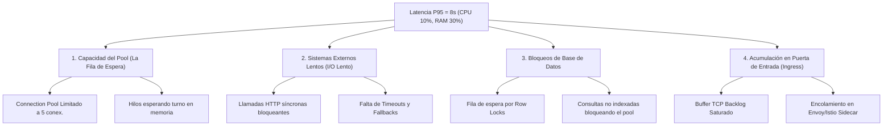

# Sustentación y Justificación Técnica - Ejercicio 1: Diagnóstico de Performance

**Rol**: Arquitecto Senior de Software / Arquitecto de Soluciones  
**Tema**: Diagnóstico de Latencia P95 = 8s con Consumo de CPU 10% y RAM 30%  
**Proyecto de Referencia**: `pregunta_01/`  
**Enfoque de Comunicación**: Técnico Riguroso + Explicación Didáctica y Accesible para Cualquier Nivel  

---

## 💡 1. Explicación Sencilla y Didáctica (La Analogía del Banco)

> **Para entender este problema sin necesidad de ser un experto en sistemas, imaginemos la ventanilla de un banco:**
> 
> * **CPU al 10%**: Los cajeros del banco no están ocupados corriendo ni cansados. De hecho, están sentados con los brazos cruzados la mayor parte del tiempo.
> * **RAM al 30%**: El edificio del banco está limpio y ordenado, sin cajas amontonadas.
> * **Latencia P95 de 8 segundos**: Sin embargo, los clientes afuera tienen que hacer una fila larguísima que avanza muy lento.
> 
> **¿Por qué hay fila si los cajeros no están cansados?**  
> Porque solo hay **5 ventanillas abiertas** y cada cajero está atendiendo a un cliente mientras **espera una llamada telefónica de 8 segundos con la oficina central**. 
> 
> El problema no es que falten cajeros ni que el banco sea pequeño (no falta CPU ni RAM). El problema es que los cajeros se quedan **esperando al teléfono** y los clientes de afuera se quedan **atrapados en la fila de espera**.
> 
> En software, a esto lo llamamos **I/O Wait / Agotamiento de Pool de Conexiones**: la aplicación no está trabajando activamente; simplemente está **esperando a que un sistema externo o base de datos le responda**.

---

## 📊 2. Resumen Técnico Ejecutivo

* **Consumo de CPU**: **10%** (Subutilización por espera)
* **Consumo de Memoria RAM**: **30%** (Saludable)
* **Percentil 95 de Latencia (P95)**: **8.0 segundos** (Inaceptable para producción)

### Diagnóstico del Arquitecto
Se descarta totalmente un problema de falta de procesador (CPU-bound) o fugas de memoria (Memory Leaks). El sistema está en un estado de **Resource Waiting (Espera de Recursos)**. Los hilos de trabajo se encuentran en estado `WAITING` o `BLOCKED`, reteniendo las solicitudes en cola de memoria.

---

## 🔍 3. Árbol de Investigación: ¿Qué investigaríamos?

### Eje 1: Agotamiento de Connection Pool y Thread Pool Starvation
* **Causa**: El pool de conexiones hacia la base de datos o API downstream permite un número muy limitado de peticiones simultáneas (e.g. 5 conexiones).
* **Efecto**: Cuando entran 50 peticiones concurrentes, 5 avanzan y 45 quedan en cola esperando. La CPU no trabaja mientras esperan en cola, pero el usuario percibe 8 segundos de espera.

### Eje 2: Bloqueo Síncrono en Dependencias Downstream
* **Causa**: La API REST llama a un microservicio externo que tarda 8 segundos.
* **Efecto**: El hilo de ejecución queda congelado escuchando el socket de red (`SocketRead`), sin consumir CPU pero ocupando la conexión.

### Eje 3: Contención de Bloqueos en Base de Datos (Row Locks)
* **Causa**: Múltiples solicitudes intentan actualizar el mismo registro en la base de datos simultáneamente.
* **Efecto**: La base de datos obliga a las transacciones secundarias a esperar hasta que la primera finalice.

---

## 🛠️ 4. Estrategia de Solución y Remediación

### A. Acciones Inmediatas
1. **Configuración de Timeouts Estrictos y Circuit Breaker**: Cortar la espera tras 2.0 segundos si el servicio externo no responde, retornando una respuesta rápida de contingencia (*fallback*) para no colapsar la experiencia del usuario.
2. **Ajuste de Capacidad del Pool**: Redimensionar el pool de conexiones según la concurrencia real esperada.

### B. Arquitectura Definitiva
1. **I/O Asíncrono No Bloqueante (Event-Loop Driven Architecture)**: Frameworks como FastAPI, Node.js o Spring WebFlux liberan los hilos mientras la red responde.
2. **Arquitectura Orientada a Eventos (EDA)**: Para procesos pesados de 8 segundos, retornar un `HTTP 202 Accepted` de inmediato y procesar la tarea en segundo plano usando Apache Kafka o RabbitMQ.
3. **Caché Distribuida (Redis)**: Responder lecturas repetitivas en < 5ms sin tocar dependencias lentas.
4. **Autoscaling por Latencia o Queue Depth**: Configurar el escalado de pods en Kubernetes basándose en la **latencia P95 o tamaño de cola**, nunca en consumo de CPU/RAM.

---

## 📋 5. Comparación Resumida

| Métrica / Aspecto | Estado Actual | Estado Objetivo | Explicación Sencilla |
| :--- | :--- | :--- | :--- |
| **CPU Usage** | 10% | 40% - 60% | El servidor trabajará activamente sin estar esperando sin hacer nada. |
| **Latencia P95** | **8.0 segundos** | **< 150 milisegundos** | El usuario recibe respuesta instantánea. |
| **Manejo de I/O** | Síncrono Bloqueante | Asíncrono / Circuit Breaker | En lugar de quedarse colgado en la línea, el sistema avisa o usa memoria rápida. |
