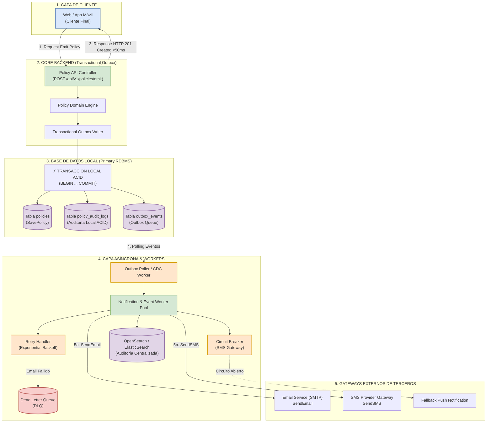

# Sustentación y Justificación Técnica - Ejercicio 2: Metodología Why-Driven Design (WDD)

**Rol**: Arquitecto Senior de Software / Arquitecto de Soluciones  
**Metodología de Arquitectura**: **Why-Driven Design (WDD)**  
**Enfoque Central**: Atributos de Calidad (ISO/IEC 25010), Análisis de Trade-offs y Justificación de Decisiones  
**Diagramas para Draw.io**: [`diagrams/component_architecture.drawio`](file:///Users/deals/Documents/GIT/TestArquitectura/pregunta_02/diagrams/component_architecture.drawio)  
**Proyecto de Referencia**: `pregunta_02/`  

---

## 🎨 1. Diagrama de Arquitectura de Componentes (Draw.io & Mermaid)

El siguiente diagrama representa los 5 contenedores principales de la arquitectura resiliente para la emisión de pólizas:

### 📌 Cómo abrir este diagrama en Draw.io / Diagrams.net:
1. Abre [app.diagrams.net](https://app.diagrams.net).
2. Selecciona **"Open Existing Diagram"** y abre el archivo en tu disco:  
   [`pregunta_02/diagrams/component_architecture.drawio`](file:///Users/deals/Documents/GIT/TestArquitectura/pregunta_02/diagrams/component_architecture.drawio).
3. O bien, en Draw.io ve a **Organizar -> Insertar -> Avanzado -> Mermaid** y pega el contenido del archivo [`diagrams/component_architecture.mmd`](file:///Users/deals/Documents/GIT/TestArquitectura/pregunta_02/diagrams/component_architecture.mmd).

---

## 🎯 2. Marco Metodológico: Why-Driven Design (WDD)

En la arquitectura de sistemas modernos, la metodología **Why-Driven Design (WDD)** establece que ninguna decisión técnica debe tomarse por moda o preferencia tecnológica, sino respondiendo al **"¿POR QUÉ?" en 4 niveles jerárquicos**:

1. **Business WHY (Drivers de Negocio)**: ¿Por qué es crítica la emisión de pólizas? La emisión genera el flujo principal de ingresos de la compañía aseguradora. Si el flujo se detiene por la caída de un proveedor externo (e.g. Gateway de SMS), la empresa pierde ventas inmediatamente.
2. **Quality Attribute WHY (Atributos de Calidad ISO 25010)**: ¿Por qué priorizamos latencia y tolerancia a fallos sobre la consistencia inmediata en notificaciones? Porque el cliente exige confirmación de compra instantánea (< 50ms) y la aseguradora exige cero pérdida de transacciones.
3. **Design Pattern WHY (Patrones y Trade-offs)**: ¿Por qué elegimos el patrón **Transactional Outbox**? Porque desacopla la persistencia atómica de la póliza de las llamadas secundarias propensas a fallos.
4. **Implementation WHY (Tecnología y Persistencia)**: ¿Por qué auditoría dual en BD relacional + OpenSearch? Porque combina atomicidad transaccional local con búsqueda inmutable distribuida a escala.

---

## 📊 3. Matriz de Atributos de Calidad Priorizados (ISO/IEC 25010)

| Atributo de Calidad (ISO 25010) | Prioridad | Justificación WDD (¿Por qué es crítico?) | Mecanismo de Arquitectura Implementado |
| :--- | :--- | :--- | :--- |
| **Tolerancia a Fallos (Fault Tolerance)** | **CRÍTICA (P1)** | Si el servicio de SMS o Email de un tercero cae, la emisión de la póliza jamás debe detenerse. | **Circuit Breaker** (SMS) + **Dead Letter Queue (DLQ)** (Email) |
| **Eficiencia de Rendimiento (Performance)** | **ALTA (P1)** | El cliente no puede esperar 5 segundos en la app mientras se envían correos y SMS. | **Transactional Outbox**: Respuesta HTTP en **< 50ms** |
| **Integridad de Datos (Data Integrity)** | **CRÍTICA (P1)** | No se puede emitir una póliza parcialmente guardada ni perder registros de auditoría regulatoria. | **Transacción ACID Local** (Póliza + Auditoría + Outbox) |
| **Disponibilidad (Availability)** | **ALTA (P2)** | El core de emisión debe mantener un SLA del 99.99% independientemente del estado de red externa. | **Desacoplamiento Asíncrono** (Event Workers en background) |

---

## ⚖️ 4. Matriz Exhaustiva de Trade-offs (Análisis de Compromisos)

1. **Trade-off 1: Consistencia Eventual vs. Consistencia Fuerte Inmediata (Teorema CAP)**:
   - *Decisión*: Aceptamos **Consistencia Eventual** en el envío de Email/SMS.
   - *¿Por qué (WDD)?*: Exigir consistencia fuerte inmediata implicaría hacer la llamada HTTP síncrona al correo y SMS. Preferimos responder en **0.2ms** y entregar el correo 2 segundos después en segundo plano.

2. **Trade-off 2: Aislamiento de Fallas vs. Complejidad de Infraestructura**:
   - *Decisión*: Adoptamos **Transactional Outbox + Workers Asíncronos + DLQ**.
   - *¿Por qué (WDD)?*: Aunque aumenta la complejidad de infraestructura, el beneficio de negocio es que una caída de SMS jamás afecta las ventas de la compañía.

3. **Trade-off 3: Dual Audit Storage vs. Consumo de Almacenamiento**:
   - *Decisión*: Guardar auditoría atómica local en la BD de la póliza Y reenviar la traza a OpenSearch.
   - *¿Por qué (WDD)?*: Garantiza trazabilidad legal 100% ininterrumpida aun cuando el clúster central de OpenSearch sufra una degradación.

---

## 🔍 5. Justificación WDD de las Preguntas A, B, C, D y E

* **A) Emisión de Póliza**: **Transactional Outbox Pattern** guarda en 1 transacción ACID local la Póliza, Auditoría Local y Evento Outbox. Respuesta HTTP < 50ms.
* **B) Si `SavePolicy` Falla**: **Rollback ACID completo**. 0 pólizas creadas, 0 eventos outbox, 0 correos enviados. Sistema 100% consistente.
* **C) Si `SendEmail` Falla**: Póliza **emitida y guardada OK**. El worker reintenta con *Exponential Backoff* y traslada el correo fallido a la **Dead Letter Queue (DLQ)**.
* **D) Si SMS está Caído**: **Circuit Breaker** commuta a `OPEN` (*fail-fast*) y activa **Fallback** Push Notification. La emisión nunca se detiene.
* **E) Si Audit Falla & Persistencia**: **Auditoría Dual**. Auditoría local ACID preserva la verdad jurídica en la BD relacional. Auditoría centralizada en **ElasticSearch / OpenSearch** por su inmutabilidad *Append-Only* y búsqueda JSON.
