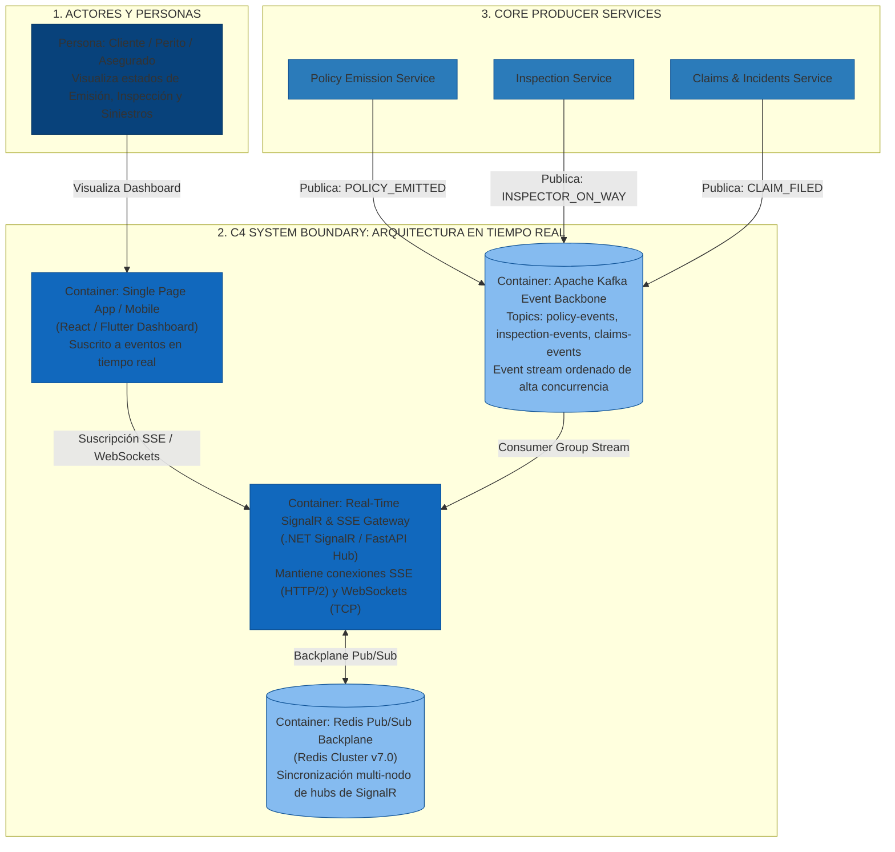

# Sustentación Técnica - Ejercicio 3: Arquitectura en Tiempo Real (Real-Time Architecture)

**Rol**: Arquitecto Senior de Software / Arquitecto de Soluciones  
**Metodología de Arquitectura**: **Why-Driven Design (WDD)**  
**Enfoque Central**: Atributos de Calidad (ISO/IEC 25010), Análisis de Trade-offs y Modelo C4  
**Experiencia de Sector**: **Apache Kafka Event Backbone** & **Sistemas Distribuidos de Notificación Push / SignalR / Chat**  
**Diagramas C4 para Draw.io**: [`diagrams/c4_model_realtime_architecture.drawio`](file:///Users/deals/Documents/GIT/TestArquitectura/pregunta_03/diagrams/c4_model_realtime_architecture.drawio)  
**Proyecto de Referencia**: `pregunta_03/`  

---

## 💡 1. Explicación Didáctica y Accesible (La Analogía de Uber / Domino's Pizza Tracker)

> **Para explicar esta arquitectura a cualquier público:**
> 
> Cuando pides una pizza en Domino's o pides un viaje en **Uber**:
> 
> 1. **Estado de Emisión (Orden Confirmada / Cobro Exitoso)**: Ves en la pantalla *"Orden recibida"*.
> 2. **Estado de Inspección (Preparando / Repartidor asignado)**: La pantalla cambia en tiempo real a *"En el horno"*, *"Repartidor en camino"* y ves el carrito moviéndose en el mapa.
> 3. **Estado de Siniestros (Soporte en Vivo / Grúa en camino)**: Si hay un incidente, la app te muestra *"Grúa despachada, llega en 4 mins"*.
> 
> **¿Por qué la app NO recarga la página a cada segundo (Short Polling)?**  
> Porque si millones de personas recargaran la página a la vez, tumbarían los servidores. En su lugar, el servidor establece un **"Tubo de comunicación directo"** (Server-Sent Events / SignalR WebSockets) y **empuja (*PUSH*) el cambio inmediatamente** en milisegundos cuando **Apache Kafka** notifica la novedad.

---

## 🎨 2. Modelo C4 de la Arquitectura en Tiempo Real (C4 Level 2 - Container Diagram)

El siguiente diagrama en formato **C4 Model** representa la estructura distribuida con **Apache Kafka**, el **SignalR / SSE Gateway** y el **Redis Pub/Sub Backplane**:



### 📌 Cómo abrir y presentar el Modelo C4 en Draw.io:
1. Abre [app.diagrams.net](https://app.diagrams.net).
2. Selecciona **"Open Existing Diagram"** y carga:  
   [`pregunta_03/diagrams/c4_model_realtime_architecture.drawio`](file:///Users/deals/Documents/GIT/TestArquitectura/pregunta_03/diagrams/c4_model_realtime_architecture.drawio).

---

## 🎯 3. Marco Metodológico: Why-Driven Design (WDD)

Bajo **Why-Driven Design (WDD)**, justificamos la arquitectura respondiendo al **¿POR QUÉ?**:

1. **Business WHY**: ¿Por qué tiempo real en Emisión, Inspección y Siniestros? Reduce drásticamente las llamadas de soporte en el Call Center (*"¿Dónde está mi perito?"* / *"¿Se emitió mi póliza?"*), mejorando la experiencia del usuario y disminuyendo costos operativos.
2. **Quality Attribute WHY (ISO 25010)**: Priorizamos **Eficiencia de Rendimiento** (Latencia Push < 10ms) y **Escalabilidad Horizontal** (SLA 99.99% con Redis Backplane).
3. **Design WHY**: ¿Por qué **Apache Kafka** como Backbone + **SSE/SignalR** en la frontera? Kafka maneja millones de eventos por segundo con ordenamiento garantizado en particiones; el Gateway traslada el evento al cliente sin acoplar la BD relacional.
4. **Technology WHY**: ¿Por qué SSE para dashboards de lectura y SignalR con Redis Backplane? SSE es un estándar HTTP/2 nativo liviano; SignalR abstrae clientes heterogéneos y escala nodos mediante Redis Pub/Sub.

---

## 📊 4. Matriz Comparativa y Trade-offs Exigidos

Un *trade-off* es el compromiso consciente de aceptar una desventaja técnica a cambio de un beneficio superior para el negocio:

| Tecnología | Mecanismo de Transporte | Pros Principales | Contras / Trade-offs (Compromisos) | Justificación WDD |
| :--- | :--- | :--- | :--- | :--- |
| **WebSockets** | Bi-direccional Full-Duplex (TCP) | Latencia ultra baja (< 5ms), bidireccionalidad nativa, binario/texto. | Requiere mantener estado (*Stateful*), rompe balanceadores HTTP sin **Sticky Sessions** / **Redis Backplane**. | Ideal para chats interactivos o tableros de edición colab. |
| **SignalR (.NET)** | Abstracción Multicanal Hub | Negociación automática (WebSockets -> SSE -> Long Polling), manejo de grupos. | Sobrecarga de metadatos en el hub, lock-in a cliente SDK de SignalR. | **RECOMENDADO PARA ECOPOSITIVIDAD .NET**: Excelente productividad y resiliencia. |
| **SSE (Server-Sent Events)** | Uni-direccional Server -> Client | **Protocolo HTTP/2 nativo**, reconexión automática del browser, atraviesa firewalls sin upgrades TCP. | Solo Server -> Client (cliente debe usar POST tradicional). Límite de 6 conex en HTTP/1.1 (resuelto con HTTP/2). | **RECOMENDADO PARA DASHBOARDS DE SEGUROS**: Emisión, Inspección y Siniestros son lecturas push unidireccionales. |
| **Short Polling** | Peticiones HTTP continuas (e.g. 2s) | Extremadamente fácil de implementar. | **Ineficiencia masiva**: 95% de llamadas retornan datos sin cambios, satura pool HTTP y CPU. | **NO RECOMENDADO**: Destruye la escalabilidad en producción. |
| **Long Polling** | Petición HTTP retenida (Hold request) | Compatible con navegadores legacy muy antiguos. | Retiene hilos en el servidor, reconexiones frecuentes, latencia variable. | Solo como **Fallback extremo** en SignalR. |

---

## ⚡ 5. El Rol de Apache Kafka en la Arquitectura de Tiempo Real

En una arquitectura distribuida de alto volumen, el servidor web **no debe consultar la base de datos a cada segundo**.

```text
 [Sistemas Core] ──► [Kafka Topics] ──► [Real-Time Gateway] ──► [Redis Backplane] ──► [Clientes SSE/SignalR]
```

1. **Desacoplamiento Total**: Los microservicios de Emisión, Inspección y Siniestros publican sus eventos en tópicos de Kafka (`policy-events`, `inspection-events`, `claims-events`).
2. **Escalabilidad Masiva**: Kafka procesa más de 100,000 TPS por nodo con orden estricto por clave (`Partition Key = PolicyId`).
3. **Escalado Horizontal de Hubs con Redis Backplane**: Si tenemos 10 nodos del Gateway de SignalR/SSE, el **Redis Pub/Sub Backplane** asegura que el mensaje llegue al cliente sin importar a cuál nodo esté conectado su WebSocket/SSE.
