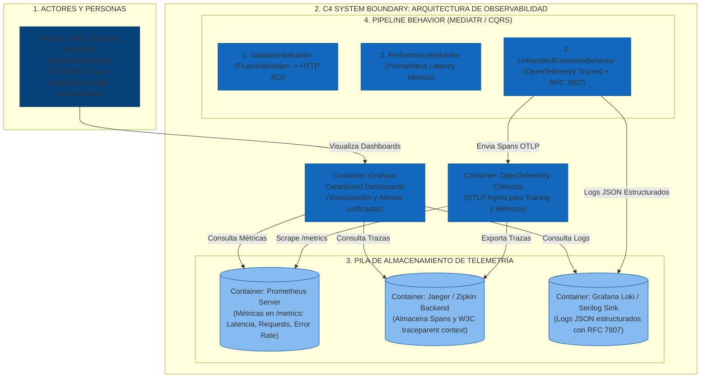

# Sustentación Técnica - Ejercicio 5: Observabilidad, Pipeline Behavior y Gestión de Excepciones

**Rol**: Arquitecto Senior de Software / Arquitecto de Soluciones  
**Metodología de Arquitectura**: **Why-Driven Design (WDD)**  
**Enfoque Central**: **Pipeline Behaviors (MediatR CQRS)**, Clean Architecture (.NET 9), Diagnóstico del Anti-patrón `catch(Exception ex) { return BadRequest(); }`, Modelo de Madurez de Richardson, OpenTelemetry, Prometheus, RFC 7807 y C4 Model  
**Diagramas C4 para Draw.io**: [`diagrams/c4_observability_architecture.drawio`](file:///Users/deals/Documents/GIT/TestArquitectura/pregunta_05/diagrams/c4_observability_architecture.drawio)  
**Proyecto de Referencia**: `pregunta_05/`  

---

## 💡 1. Explicación Didáctica y Experiencia Real: Pipeline Behavior (MediatR) & La Caja Negra de Aviación

> **Basado en la experiencia real del Arquitecto con Pipeline Behavior (MediatR / CQRS):**
> 
> En arquitecturas empresariales Clean Architecture con patrones CQRS, **el manejo de errores NUNCA debe hacerse dentro de los controladores ni en los Handlers mediante bloques try-catch repetitivos** como `catch(Exception ex) { return BadRequest(); }`.
> 
> En su lugar, aplicamos la solución de **Pipeline Behaviors (Cross-Cutting Concerns en MediatR)**:
> 
> 1. **`ValidationBehavior`**: Intercepta los Requests antes de ejecutar el handler. Si las reglas de negocio o validaciones de FluentValidation fallan, detiene la ejecución inmediatamente y lanza una `DomainValidationException` mapeada automáticamente al **Nivel 2 de Richardson (`422 Unprocessable Entity`)**.
> 2. **`UnhandledExceptionBehavior`**: Envuelve toda la canalización de ejecución. Captura excepciones no controladas, les inyecta el `TraceId` y `SpanId` de **OpenTelemetry**, las registra en formato JSON estructurado con **Serilog/Loki** y las transforma en respuestas estandarizadas **RFC 7807 (ProblemDetails)**.
> 3. **`LoggingAndPerformanceBehavior`**: Mide la latencia de cada Command/Query, alimenta el histograma de **Prometheus** y genera alertas si el tiempo de ejecución supera los SLA predefinidos (> 500ms).

---

## 🎨 2. Modelo C4 de la Arquitectura con Pipeline Behavior (C4 Level 2 - Container Diagram)

El siguiente diagrama en formato **C4 Model** representa la estructura distribuida de observabilidad y el pipeline de ejecución:



---

## 🎯 3. Marco Metodológico: Why-Driven Design (WDD)

Bajo **Why-Driven Design (WDD)**, justificamos las decisiones de Pipeline Behavior respondiendo al **¿POR QUÉ?**:

1. **Business WHY**: Evitar la dispersión de lógica de manejo de errores en cientos de controladores. Centralizar la observabilidad en Pipeline Behaviors asegura que el 100% de los microservicios cumplan los estándares de trazabilidad y gobernanza de la compañía.
2. **Quality Attribute WHY (ISO 25010)**: Priorizamos **Mantenibilidad y Modificabilidad** (Principios SOLID: Single Responsibility y Open/Closed Principle), **Operabilidad** (Trazabilidad E2E con TraceId) e **Interoperabilidad** (Formato RFC 7807 ProblemDetails).
3. **Design WHY (Pipeline Behavior Pattern)**: El patrón de Pipeline Behavior intercepta las solicitudes de manera transparente. El desarrollador solo escribe la lógica de negocio pura en el Handler; la validación, el logging, las métricas y la captura de excepciones ocurren automáticamente en la canalización.
4. **Technology WHY**: **MediatR `IPipelineBehavior<TRequest, TResponse>`** en .NET 9 desacopla los controladores de las dependencias de infraestructura y garantiza la integración nativa con **OpenTelemetry** y **Serilog**.

---

## 🔍 4. Respuesta Exhaustiva a las Preguntas A y B

### A) ¿Qué problemas ve en el código `catch(Exception ex) { return BadRequest(); }`?

1. **Anti-patrón de Captura Ciega en Controladores**:
   Escribir `try-catch` manualmente en cada método del controlador duplica código, viola el principio DRY (*Don't Repeat Yourself*) y degrada la mantenibilidad.
2. **Pérdida de Trazabilidad Distribuida (Distributed Tracing Context Drop)**:
   Al capturar `catch(Exception ex)` y retornar un `BadRequest()` ciego, se rompe la propagación del encabezado W3C `traceparent` (`TraceId` / `SpanId`), impidiendo correlacionar el fallo en Jaeger o Grafana.
3. **Violación del Modelo de Madurez de Richardson (Nivel 2/3)**:
   El modelo de Richardson establece que las APIs REST deben utilizar los códigos de estado HTTP según su significado semántico oficial:
   - Si un recurso no existe, retornar **`404 Not Found`**.
   - Si falla una regla de negocio o validación, retornar **`422 Unprocessable Entity`**.
   - Si hay un conflicto de concurrencia, retornar **`409 Conflict`**.
   - Si cae la base de datos o un servicio externo, retornar **`503 Service Unavailable`**.
   - Responder siempre `400 BadRequest` o `BadRequest()` oculta la causa raíz.
4. **Mezcla de Excepciones de Dominio vs Infraestructura**:
   Trata por igual una precondición de negocio no cumplida que una falla técnica fatal (e.g. Null Pointer o TimeOut de BD).

---

### B) Diseñar Observabilidad para la Solución Técnica (Pipeline Behavior + Herramientas)

#### 🛠️ Solución Basada en Pipeline Behaviors y los 3 Pilares de Telemetría:

```text
 Client Request ──► [ValidationBehavior] ──► [PerformanceBehavior] ──► [UnhandledExceptionBehavior] ──► Handler Execution
                          │                        │                         │
                          ▼ (HTTP 422)             ▼ (Prometheus /metrics)   ▼ (OpenTelemetry / RFC 7807)
```

1. **`ValidationBehavior` (Validación Automática)**:
   - Intercepta comandos/consultas y ejecuta validaciones de FluentValidation.
   - Si existen fallos, lanza una `ValidationDomainException` traducida automáticamente a **`HTTP 422 Unprocessable Entity`** con la lista detallada de campos inválidos.
2. **`UnhandledExceptionBehavior` (Pipeline de Excepciones & OpenTelemetry)**:
   - Captura cualquier excepción no manejada durante la ejecución del pipeline.
   - Inyecta el `TraceId` y `SpanId` (estándar W3C `traceparent`).
   - Registra un log estructurado en JSON con **Serilog** hacia **Grafana Loki**.
   - Genera una respuesta estándar **RFC 7807 (ProblemDetails JSON)** con el código de Richardson correspondiente.
3. **`PerformanceBehavior` & Prometheus Exporter**:
   - Mide el tiempo de ejecución del Handler y lo exporta hacia Prometheus en `/metrics` bajo el modelo de **RED Metrics** (Rate, Errors, Duration).

---

## ⚖️ 5. Matriz de Trade-offs (Análisis de Compromisos)

| Aspecto | Anti-patrón (`catch(Exception ex)`) | Solución Propuesta (Pipeline Behavior + OpenTelemetry) | Trade-off / Justificación WDD |
| :--- | :--- | :--- | :--- |
| **Mantenibilidad** | Pobre (try-catch repetido en controladores) | Alta (Pipeline Behavior centralizado y desacoplado) | **Compromiso**: Incurrimos en una ligera abstracción inicial en MediatR a cambio de código limpio en controladores. |
| **MTTR (Tiempo de Reparación)** | Muy alto (Horas descifrando logs) | Muy bajo (Minutos localizando `TraceId` en Jaeger) | **Compromiso**: Incurrimos en sobrecarga CPU (< 1%) por serializar la traza a cambio de visibilidad total. |
| **Semántica REST** | Pobre (Siempre `return BadRequest()`) | Alta (Modelo de Richardson Nivel 2/3: `404`, `409`, `422`, `503`) | **Compromiso**: Exige clasificar correctamente las excepciones en la capa de Dominio. |

---

## 🎯 6. Criterios de Calidad ISO/IEC 25010

1. **Mantenibilidad y Modificabilidad**: Adopción de Pipeline Behaviors permitiendo agregar nuevas validaciones sin tocar la lógica de negocio.
2. **Operabilidad**: Localización inmediata de errores mediante `TraceId` correlacionado.
3. **Interoperabilidad**: Cumplimiento del estándar W3C TraceContext y RFC 7807 ProblemDetails.
